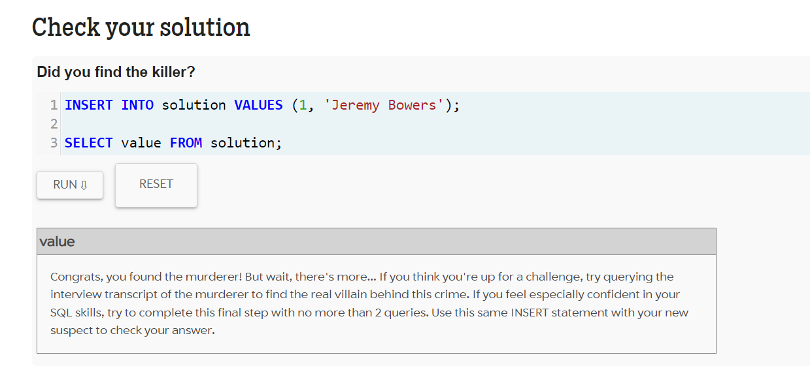
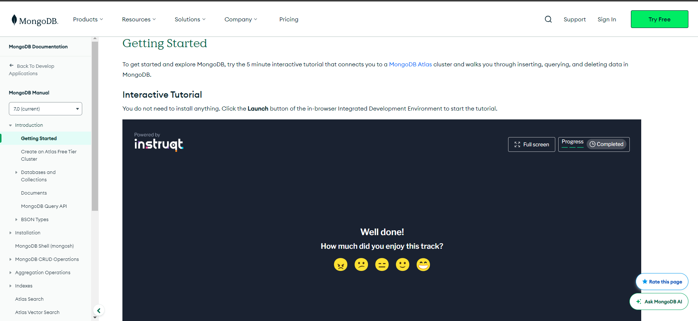
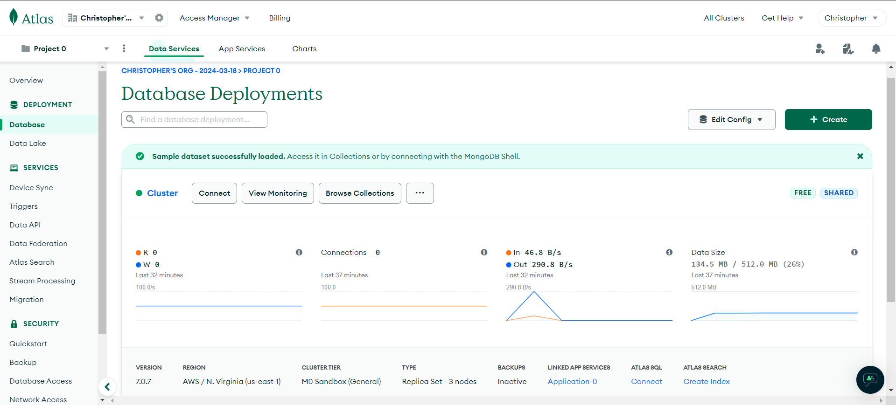
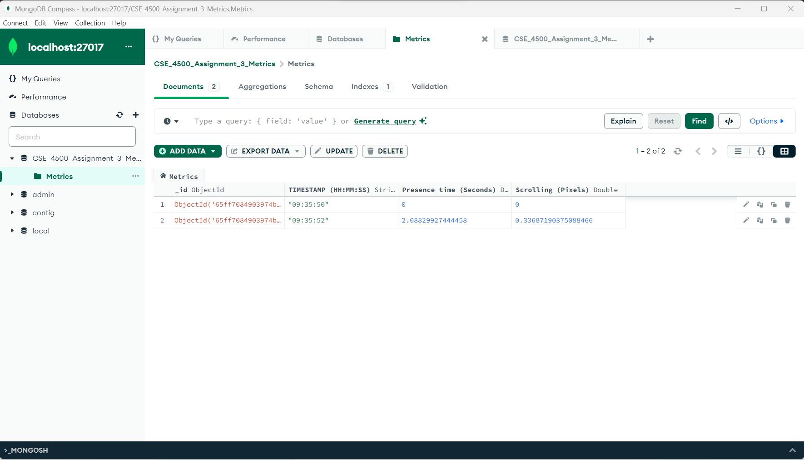

# Metric Tracker with Database

PROVIDE OVERVIEW OF ASSIGNMENT HERE

Time spent: **5-6** hours spent in total

## Features

The following **required** features are completed:

- [X] Organize Github projects for Assignment 3 (2 pts)
- [X] Complete SQL Mystery Walkthrough and take a screenshot or print to PDF the webpage (2 pts)
- [X] Complete Interactive MongoDB Tutorial and take a screenshot or print to PDF the webpage  (2 pts)
- [X] Choose a SQL or NoSQL Database and set up a server (4 pts)
- [X] Modify your metric_tracker file so that the metrics are saved onto a database (5 pts)

The following **bonus** features are implemented:

- [ ] Retrieve values from the database (1 pt).
- [ ] Create separate Tables (SQL) or Documents (NoSQL) for each metric and relate them via user (2 pt).
- [ ] DESCRIBE ANY OTHER FEATURES HERE.

## Screenshot and/or Video Walkthrough

## Notes:
PROVIDE RELEVANT OR ADDITIONAL INFORMATION HERE. Below are formatting options to add emphasis in text
<ul>
  
Difficulty in using MongoDB and getting metrics from CSV file to appear.

  
Had to view multiple YouTube tutorials before coming to the conclusion
     that it would be easier to download the entirety of MongoDB on my device.

  
Minor difficulty in finding culprit for SQL Mystery Tutorial due to syntax errors.

  
Extreme difficulty in connecting to localhost for MongoDB Compass due to not having
     MongoDB installed first.

  
Learned how to get metrics to show in table format on MongoDB Compass through YouTube tutorial.

  
Refer to Canvas submission should images not show properly through the README file via Github.

  <li>**Example in bold**</li>
  <li>*Example in italics*</li>
</ul>
