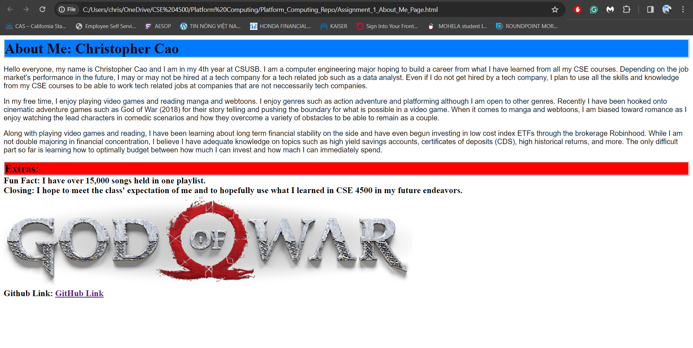

# About Me

Create an "About Me" page using HTML and CSS on VS Code
Learning how to submit via Github link
PROVIDE OVERVIEW OF ASSIGNMENT HERE

Time spent: **4** hours spent in total

## Features

The following **required** features are completed:

- [X] Modifies title in head so that the tab has a unique name, (e.g. About Me). (1pts)
- [X] Uses a mix of headers, paragraphs, and div's. (3pts)
- [X] Includes at least 3 paragraphs. (3pts)
- [X] Includes at least one image. (2pts)
- [X] Includes a .css file to style with at least 4 ways to format the elements in the html. (3pts)
- [X] Includes a link that directs to your Github account (can be main account or specifically to your Platform_Computing Repo). (3pts)

The following **bonus** features are implemented:

- [X] Applies different font(s). (0.5 pt)
- [X] Applies border and margins. (0.5 pt)
- [ ] DESCRIBE ANY OTHER FEATURES HERE.

## Screenshot and/or Video Walkthrough

## Notes:
PROVIDE RELEVANT OR ADDITIONAL INFORMATION HERE. Below are formatting options to add emphasis in text
<ul>
  
Use of VS Code with Live Server extension to write code and show output.
     sometimes opened HTML file on new tab as alternative to show output.

  
Difficulty in including screenshot of HTML/CSS code running

  
Border and margins difficult to spot in output unless code was seen beforehand

  
Consulted search engine to learn how to type comments in HTML file

  <li>**Example in bold**</li>
  <li>*Example in italics*</li>
</ul>
